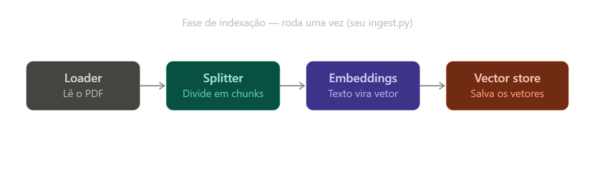

# Tutorial do projeto

## Fonte de dados

### 1. Acesse o site da Receita Federal
Vá em [gov.br/receitafederal](https://www.gov.br/pt-br) (o portal oficial). Evite qualquer outro site que ofereça o PDF. Só baixe do domínio gov.br para garantir que é a fonte oficial.
É necessário fazer login.

### 2. Procure por "Perguntas e Respostas IRPF 2026"
Use a busca do próprio site ou vá em Centrais de Conteúdo > Publicações.
O documento também é conhecido como "[Perguntão do IR](https://www.gov.br/receitafederal/pt-br/centrais-de-conteudo/publicacoes/perguntas-e-respostas/dirpf/p-r-irpf-2026-v1-00-2026-04-23.pdf/view)".

### 3. Baixe o PDF
Salve o arquivo. Ele deve ter centenas de páginas (745 perguntas),
então pode demorar um pouco pra baixar.

### 4. Salve dentro do projeto
Coloque o arquivo em `data/perguntas-respostas-irpf-2026.pdf` dentro do seu repositório rag-faq-assistant,
é esse arquivo que vai virar a fonte de dados de todo o pipeline RAG.

OBS: A princípio não comite este arquivo.

## 1. docs/Arquivo de ingestão
O primeiro arquivo que vamos escrever é o `src/ingest.py`. Esse arquivo é responsável
pela primeira etapa do seu RAG: pegar o PDF e transformá-lo em dados que possam ser pesquisados
semanticamente.

Este arquivo contém 3 funções:
- Uma para carregamento do PDF.
- Uma para dividir o documento em `chuncks`.
- Uma para gerar e salvar os embbeding.

Ao executar esse arquivo `python src/ingest.py`
Ele vai gerar a pasta `chroma_db/`

Essa pasta é o banco vetorial do nosso RAG.

Ela vai conter os dados necessários para o Chroma armazenar:

- os chunks do PDF;
- os embeddings desses chunks;
- metadados associados aos documentos;
- os índices/estruturas usados para fazer a busca vetorial.

Nossa árvore de arquivos será:
```
rag-faq-assistant/
├── data/
│   └── perguntas-respostas-irpf-2026.pdf     <- Arquivo fonte não comitado
│
├── src/
│   ├── ingest.py    <-Arquivo atual
│   ├── rag_chain.py
│   └── main.py
│
├── chroma_db/                 ← GERADO PELO ingest.py
│   ├── ...
│   └── ...
│
├── requirements.txt
└── README.md
```
E uma observação importante: como `chroma_db/` é gerado automaticamente,
normalmente a gente também coloca no `.gitignore`:

```
venv/
.venv/

data/
chroma_db/
```

**Rodando ingest.py**
Antes de rodar ingest.py,
1. Rode o requirements.txt:

`python3 -m pip install -r requirements.txt`

2.Rode `ingest.py``:

`python3 src/ingest.py`

**Guia de troubleshooting:**
Leia a Guia de Troubleshooting aqui, caso tenhma algum problema
com os modelos.


3.Após rodar ingest.py

Se tudo estiver configurado corretamente (Ollama rodando, modelos baixados,
PDF salvo em `data/`), o terminal vai mostrar algo assim:

```text
PDF carregado: 340 páginas.
Documento dividido em 1513 chunks.
Embeddings salvos em 'chroma_db/'.
Ingestão concluída!
O vector store está pronto para uso.
```

**O que aconteceu:**

1. **Loader**: o PDF foi lido e transformado em 340 `Document` (um por página).

2. **Splitter**: esses 340 documentos foram divididos em 1513 chunks menores
   (chunk_size=1000, overlap=200).

3. **Embeddings**: cada um dos 1513 chunks foi enviado pro modelo local
   `nomic-embed-text` (via Ollama) e transformado em um vetor numérico.
   Essa é a etapa que mais demora - pode levar alguns minutos, dependendo
   da sua máquina, porque roda 100% local, sem GPU dedicada.

4. **Vector store**: todos os vetores foram salvos numa pasta nova chamada
   `chroma_db/`, criada automaticamente na raiz do projeto.

**O que conferir depois que terminar:**
- [ ] A pasta `chroma_db/` apareceu no projeto (rode `ls` ou olhe no
      explorador de arquivos)
- [ ] Ela não está vazia - deve ter arquivos dentro (um banco SQLite e
      alguns arquivos binários)
- [ ] Não é preciso rodar o `ingest.py` de novo toda vez - só se você trocar
      o PDF fonte ou mudar o `chunk_size`/`chunk_overlap`

**Se demorar muito e parecer travado:** é esperado em máquinas sem GPU -
1513 chunks passando um a um pelo modelo de embeddings local leva um
tempo. Se passar de ~15-20 minutos sem nenhuma mensagem nova, aí sim vale
investigar (verifique se o Ollama ainda está respondendo com
`ollama list` em outro terminal).

**Próximo passo:** com a `chroma_db/` criada, o projeto está pronto pra
`rag_chain.py` - que é quem vai *ler* esses vetores pra responder perguntas.

## 2. docs/rag_chain.py

Este aruivo implementa a fase de consulta do RAG, o que acontece a cada pergunta
que o usuário faz, em contraste com o `ingest.py`, que roda só uma vez (fase de indexação).

**O que ele faz**

Ele junta as três peças que vimos no diagrama de consulta:

1. Retriever  recebe a pergunta, transforma em vetor e busca os chunks mais parecidos.
2. Prompt template - monta a mensagem final juntando pergunta + contexto recuperado,
com a instrução de não inventar resposta.
3. LLM (llama3.2:3b via Ollama) - lê esse prompt e gera a resposta

No final, a função `perguntar()` devolve tanto a resposta quanto as
fontes usadas (trecho + página), pra você conseguir verificar de onde veio
cada informação.

**Por que ele depende do chroma_db/**

Porque o retriever não gera conhecimento novo.
Ele só busca entre o que já foi indexado.
O chroma_db/ é justamente o "banco de dados" com os
1513 chunks do PDF já transformados em vetores pelo ingest.py

[link]Para saber mais consulte o material de estudos aqui.

Em resumo: `ingest.py` escreve no `chroma_db/`; o `rag_chain.py` lê dele.

Esse script tem 4 funções:
1. montar_retriever()
Essa função é responsável por abrir o banco vetorial e preparar a busca.

2. formatar_contexto()
Essa função recebe os documentos encontrados pelo retriever.
A função junta tudo.

3. montar_chain()
Essa é a principal função de montagem do RAG.
Ela monta toda a sequência:

```
Retriever
   ↓
Contexto
   ↓
Prompt
   ↓
LLM
   ↓
Texto
```
Atenção na:
`llm = ChatOllama(model=LLM_MODEL, temperature=0)`

Temperatura é uma configuração para deixar a geração mais determinística.
Não seja criativo. Responda com base no documento.

4.Perguntar()
Recebe a pergunta, executa o RAG e devolve resposta + fontes.
Essa função monta toda a estrutura que estudamos.

Com este arquivo pronto, vmaos testar se o RAG em si funciona.
O RAG NÃO A API.

## Testando RAG

Se você pular direto pro próximo .py sem testar isso, 
e algo der errado depois, você não vai saber se o problema 
é na geração da resposta ou na camada da API por cima dela.

Rode: `python3 src/rag_chain.py`

Lembrando que a pergunta é:
`pergunta = "Preciso declarar se recebi um imóvel de herança?"`

Atenção: Pode demorar um pouco.
É normal a tela ficar "parada" sem nada aparecer,
porque diferente do ingest.py (que tem print a cada etapa),
o `rag_chain.py` só imprime no final, depois que tudo terminou.

**O que está acontecendo por trás, nessa ordem**

1. Conectar no `chroma_db/`. Rápido, só abre a pasta já existente (segundos)
2. Transformar sua pergunta em vetor. Rápido, uma chamada só ao `nomic-embed-text`
3. Buscar os chunks mais parecidos. Rápido, é busca por similaridade matemática, não passa pelo LLM
4. Gerar a resposta com o llama3.2:3b. Essa é a etapa lenta. É o LLM "pensando" e escrevendo
a resposta palavra por palavra, rodando 100% na sua CPU (sem GPU, no meu caso WSL),
o que é bem mais devagar que os provedores de nuvem que nos ja usamos (ChatGPT, claude etc)

O código chama isso duas vezes (uma pra gerar a resposta, outra pra pegar as fontes).
O que também soma no tempo total.

Como confirmar que não travou sem interromper: `ollama list`

Verifique se funcionou.
Verifique a resposta. O que está bom ou não?
O que vale investigar?
Documente para investigar depois.

### Teste 1: "Preciso declarar herança de imóvel?"
```
- Resposta: correta
- Fontes: 2 de 4 relevantes (páginas 261, 263)
- página 32 trouxe conteúdo não relacionado (autenticação no portal gov.br)
- Hipótese: chunking genérico por caractere pode estar misturando 
conteúdo de perguntas diferentes num mesmo chunk
```


Nesse caso, a da página 32 é sobre autenticação no portal gov.br,
não tem nada a ver com a pergunta.
Isso é sinal de que o retriever não está trazendo os chunks mais relevantes
o tempo todo, mesmo a resposta final tendo saído certa (o LLM "adivinhou"
certo apesar do contexto parcialmente ruim).

O que devemos olhar:
`RecursiveCharacterTextSplitter`

Lembra da conversa sobre chunking? Isso é exatamente aquele ponto:
o `RecursiveCharacterTextSplitter` genérico corta por tamanho de caractere,
sem saber onde uma pergunta/resposta do documento começa ou termina.
Isso pode gerar chunks que misturam conteúdo de assuntos diferentes,
prejudicando a busca por similaridade.

Antes de ajusta o chuncking, faça mais 3 perguntas pra
ver se esse padrão se repete.

**Próximo arquivo: main.py**

Por quê: é o único arquivo que falta na cadeia de dependências.
Ele depende de `rag_chain.py` (que já está pronto e testado).
A função dele é "encapar" a perguntar() numa rota HTTP (POST /chat),
pra que o pipeline deixe de ser algo que só roda via linha de comando 
e vire uma API de verdade, que qualquer front-end (ou o Swagger) consegue chamar.

Depois dele, a cadeia principal do Projeto 1 está tecnicamente completa.
O que sobra são as issues 7, 8, 9 e 10 (testar, opcionalmente Streamlit, README final, lições aprendidas).

## 3. Arquivo `docs/main.py`

**O que tem nesse aquivo?**

é a camada de API do projeto.
o arquivo que expõe a chain de RAG (`rag_chain.py`)
como um endpoint HTTP, usando o framework FastAPI.

**Pra que serve:** até aqui, o `rag_chain.py` só podia ser usado rodando
um script Python na linha de comando. O `main.py` transforma isso em uma
API de verdade: qualquer cliente HTTP (navegador, Postman, um front-end
em React, outro serviço) consegue mandar uma pergunta e receber uma
resposta em JSON, sem precisar saber Python nem abrir o código.

**Como se integra com o que já fizemos:**
```
ingest.py → chroma_db/ → rag_chain.py → main.py → cliente (Swagger/HTTP)
(indexa)   (armazena)    (busca+gera)   (expõe via API)

```

O `main.py` não reimplementa nada do RAG, ele só importa a função
`perguntar()` de `rag_chain.py` e chama ela dentro de uma rota:

```python
from src.rag_chain import perguntar
```
Se o `chroma_db/` não existir (esqueceram de rodar o `ingest.py`) ou o
`rag_chain.py` tiver algum problema, o `main.py` não tem como funcionar,
essa é a dependência direta.

**Principais conceitos do FastAPI usados aqui:**

| Conceito | O que faz | Onde aparece no arquivo |
|---|---|---|
| `FastAPI()` | Cria a aplicação | `app = FastAPI(...)` |
| `BaseModel` (Pydantic) | Define e valida o formato dos dados de entrada/saída | `PerguntaRequest`, `RespostaResponse`, `Fonte` |
| `@app.post("/chat")` | Registra a rota — o que roda quando chega um POST em `/chat` | função `chat()` |
| `HTTPException` | Devolve um erro estruturado pro cliente (com código HTTP) | tratamento de pergunta vazia (400) e falha de consulta (500) |
| `/docs` | Interface Swagger gerada automaticamente pelo FastAPI | não precisa escrever nada, vem de graça |

**Critérios de aceite da issue #6, e como o código atende cada um:**
- ✅ `POST /chat` recebendo pergunta e devolvendo resposta → rota `chat()`
- ✅ Swagger (`/docs`) funcionando → gerado automaticamente pelo FastAPI
  a partir dos tipos declarados
- ✅ Tratamento básico de erro:
  - pergunta vazia → `HTTPException(400, ...)`
  - doc não encontrado / Ollama fora do ar → `try/except` em volta de
    `perguntar()`, devolvendo `HTTPException(500, ...)` com mensagem clara

**Como testar:**
```bash
uvicorn src.main:app --reload
```
Depois abrir `http://127.0.0.1:8000/docs` e testar a rota `POST /chat`
diretamente pela interface.

### Arquitetura

```
             ┌──────────────┐
             │     PDF      │
             └──────┬───────┘
                    ↓
             ┌──────────────┐
             │  ingest.py   │
             └──────┬───────┘
                    ↓
             ┌──────────────┐
             │    Chroma    │
             └──────┬───────┘
                    ↑
                    │
┌──────────┐   ┌────┴───────┐
│ Usuário  │ → │  main.py   │
└──────────┘   │  FastAPI   │
               └────┬───────┘
                    ↓
             ┌──────────────┐
             │ rag_chain.py │
             └──────┬───────┘
                    ↓
             ┌──────────────┐
             │   Ollama     │
             │ Llama 3.2 3B │
             └──────────────┘
                    ↓
              resposta + fontes
```
Em resumo: 

O `main.py` é a camada de API: recebe e valida a pergunta
via FastAPI, chama a função `perguntar()` da camada de RAG
e devolve uma resposta estruturada com a resposta do LLM
e os trechos-fonte.



`ingest.py` gera o `chroma_db/`, o `rag_chain.py` lê dele pra buscar+gerar a resposta,
o `main.py` encapa isso numa rota HTTP, e por fim o cliente (Swagger, Postman, 
ou um front-end futuro) chama tudo via /chat.

## Teste de API

Depois de subir o servidor (`uvicorn src.main:app --reload`), testei a rota
`POST /chat` diretamente pelo Swagger (`/docs`).

### Bug encontrado e corrigido

Na primeira tentativa, a API retornou `500 Internal Server Error`:

```
pydantic_core._pydantic_core.ValidationError: 1 validation error for Fonte
pagina
Input should be a valid string [type=string_type, input_value=261, input_type=int]
```

**Causa:** o `PyPDFLoader` guarda o número da página como `int` em
`doc.metadata["page"]`, mas o modelo `Fonte` (em `main.py`) espera uma
`str`. O Pydantic valida o tipo e rejeita.

**Correção:** em `rag_chain.py`, na função `perguntar()`, converti o valor
explicitamente:
```python
"pagina": str(doc.metadata.get("page", "desconhecida")),
```

**Observação:** o `try/except` do `main.py` não capturou esse erro porque
ele só envolve a chamada a `perguntar()` , o erro acontecia depois, ao
montar `Fonte(**f)`. Fica registrado como aprendizado sobre escopo de
`try/except`.

### Teste funcional

**Requisição:**
```json
{ "pergunta": "Preciso declarar herança de imóvel?" }
```

**Resposta (200 OK):**
```json
{
  "resposta": "Não encontrei essa informação no documento \"Perguntas e Respostas IRPF 2026\" da Receita Federal.",
  "fontes": [
    { "trecho": "...", "pagina": "261" },
    { "trecho": "...", "pagina": "263" },
    { "trecho": "...", "pagina": "261" },
    { "trecho": "...", "pagina": "312" }
  ]
}
```

**Análise:** a API funcionou de ponta a ponta (validação → chain →
resposta estruturada). O resultado em si é interessante: o modelo preferiu
dizer "não encontrei" a inventar uma resposta, comportamento correto e
intencional (ver seção "Problema de negócio" do README).

Porém, a mesma pergunta reformulada como *"Preciso declarar se recebi um
imóvel de herança?"* (testada isoladamente em `rag_chain.py`) retornou
"Sim", com fontes parcialmente diferentes. Isso indica que o retriever é
sensível à formulação exata da pergunta, ponto que será investigado com
mais profundidade na issue #7 (avaliação).

### Casos ainda a testar
- [ ] Pergunta vazia (`{"pergunta": ""}`) → esperado: `400`
- [ ] `chroma_db/` ausente/renomeada → esperado: `500` com mensagem clara


## Resultado dos testes:

**Caso 1: pergunta vazia**  ✅ perfeito

```json
{ "detail": "A pergunta não pode estar vazia." }
```
Código 400, exatamente como devia ser:
erro rápido, sem passar pelo LLM, com mensagem clara pro cliente.


**Caso 2: Esperado 500**

Com a mensagem clara que escrevemos no `main.py `
("verifique se o Ollama está rodando e se o chroma_db/ foi gerado").

O que realmente aconteceu: 200 OK, com:

```json
{
  "resposta": "Sim, você precisa declarar a herança de imóvel no Imposto de Renda.",
  "fontes": []
}
```
**Problema 1: o Chroma não dá erro quando a pasta não existe**

Diferente do que a gente imaginava, Chroma(persist_directory="chroma_db", ...)
não lança exceção se a pasta não existir.
Ele simplesmente cria um banco vazio novo silenciosamente.
Por isso o **try/except no main.py** nunca disparou:
não houve erro nenhum do ponto de vista do código,
só um banco sem nenhum dado.

**Problema 2 (mais sério): o LLM alucinou mesmo com instrução contra isso**

Sem `chroma_db`, o retriever não achou nenhum chunk ("fontes": []).
Pelo prompt que escrevemos, o modelo deveria dizer
 `"não encontrei essa informação"`, certo?
Só que ele respondeu "Sim" mesmo assim. **Alucinando** uma resposta sobre um tema
tributário sem nenhum contexto real.
Isso é exatamente o risco que o projeto existe pra prevenir,
e aconteceu porque o contexto ficou vazio (string vazia),
e o modelo "preencheu a lacuna" com conhecimento próprio, ignorando a instrução.

**Causa raiz (dois problemas):**
1. `Chroma(persist_directory=..., ...)` não lança erro se a pasta não
   existe. Ele cria um banco vazio silenciosamente.
 Por isso o  `try/except` do `main.py` nunca disparava.

2. Sem chunks recuperados, o LLM deveria dizer "não encontrei" (conforme
   o prompt), mas alucinou uma resposta afirmativa mesmo com contexto
   vazio. Evidência de que a instrução do prompt não é 100% garantida.

**Correção:** `rag_chain.py` agora verifica explicitamente se `chroma_db/`
existe antes de conectar, levantando `FileNotFoundError` com mensagem
clara, isso ativa corretamente o tratamento de erro no `main.py`.

**Por que isso importa:** esse foi o achado mais valioso dos testes até
agora, certo? mostra que "o código não deu erro" não significa "o sistema está
seguro". Alucinação silenciosa é pior que um crash visível.

**Retestar após a correção:**
- [ ] `chroma_db/` renomeada → confirmar que agora vem `500` com a
      mensagem certa


## Duas mudanças pontuais no rag_chain.py:

**1. Adicionei import os no topo**
```python
import os
from langchain_ollama import OllamaEmbeddings, ChatOllama
```
Por quê: precisei da função `os.path.exists()` pra verificar se a pasta existe,
e ela vem do módulo os (biblioteca padrão do Python, não precisa instalar nada).

**2. Adicionei uma checagem no início da função montar_retriever()**

Antes:

```python
def montar_retriever():
    """Conecta no vector store já populado e retorna um retriever."""
    embeddings = OllamaEmbeddings(model=EMBEDDING_MODEL)
    vectorstore = Chroma(
        persist_directory=PERSIST_DIR,
        embedding_function=embeddings,
    )
    return vectorstore.as_retriever(search_kwargs={"k": TOP_K})

Depois:

python
def montar_retriever():
    """Conecta no vector store já populado e retorna um retriever."""
    if not os.path.exists(PERSIST_DIR):
        raise FileNotFoundError(
            f"'{PERSIST_DIR}/' não existe. Rode 'python3 src/ingest.py' "
            "antes de usar a chain de RAG."
        )
    embeddings = OllamaEmbeddings(model=EMBEDDING_MODEL)
    vectorstore = Chroma(
        persist_directory=PERSIST_DIR,
        embedding_function=embeddings,
    )
    return vectorstore.as_retriever(search_kwargs={"k": TOP_K})
```

**Por que essa checagem é necessária**

Lembra do que descobrimos no teste?
O Chroma(...) não reclama se a pasta `chroma_db/` não existir.
ele silenciosamente cria um banco vazio.
Isso significa que, sem essa checagem manual,
o código nunca soube que havia um problema,
e seguiu em frente com um retriever "vazio", 
daí o LLM ter alucinado uma resposta sem nenhum contexto real.

Agora, antes mesmo de chegar no Chroma, eu confiro se a pasta existe.
Se não existir, levantamos um erro (FileNotFoundError),
e é esse erro que o try/except do main.py vai capturar,
devolvendo o 500 com a mensagem clara que já tínhamos escrito lá.
Ou seja: a correção não foi no main.py (que já estava certo),
foi em fazer o `rag_chain.py` falhar de propósito e de forma visível,
em vez de falhar silenciosamente.

## Repita o teste do Caso 2

No temrinal: 
```bash
mv chroma_db chroma_db_bak
```

Volte no Swagger (http://127.0.0.1:8000/docs) e rode de novo:
```json
{ "pergunta": "Preciso declarar herança de imóvel?" }
```

O que deve acontecer agora: código 500, com o detail mostrando
a mensagem do main.py que menciona rodar o ingest.py;
bem diferente do 200 com alucinação que apareceu antes.

Depois, não esqueça de desfazer:

```bash
mv chroma_db_bak chroma_db
```
Se quiser, aproveite e rode de novo o Caso 1 (pergunta vazia)
só pra confirmar que continua 400 normalmente.

